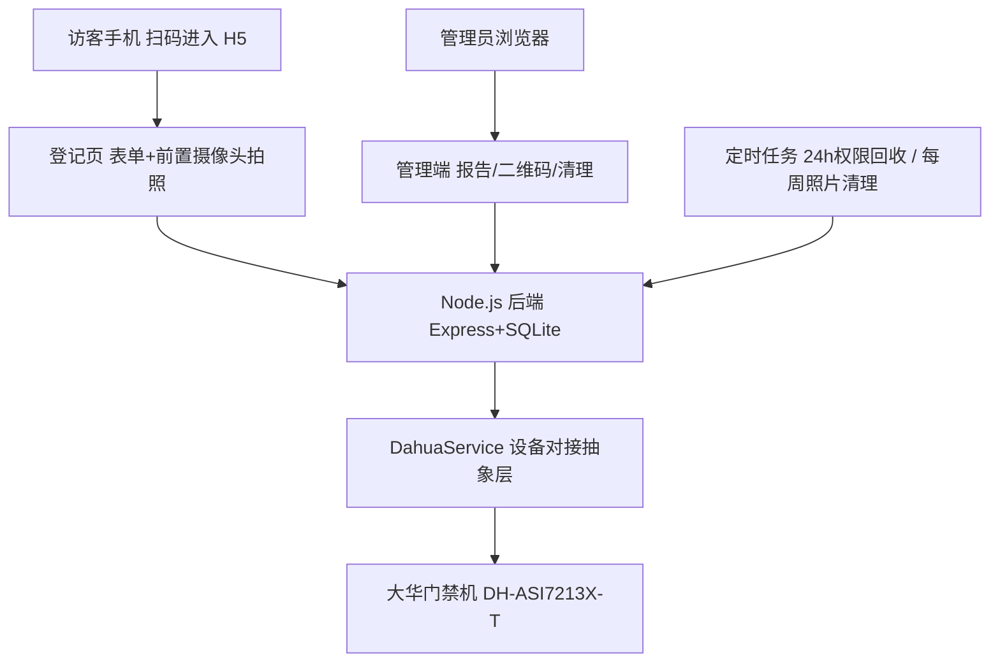

# 访客门禁管理系统（大华 DH-ASI7213X-T 对接）

访客扫码登记（姓名 / 手机号 / 来访目的 + 前置摄像头拍照），系统自动将人脸照片下发到大华人脸门禁一体机，访客在有效期内（默认 24 小时）刷脸开门；权限到期自动回收，照片每周自动清理（只删照片、保留记录）。

前端为移动端 H5（Vue 3），后端 REST API 与前端完全解耦，后续可无缝移植为微信小程序。

## 功能特性

- 访客端（手机 H5，扫码进入）
  - 登记表单：姓名、手机号、来访目的
  - 前置摄像头实时取景拍照（含人脸取景框引导、可重拍），不支持时降级为系统相机
  - 照片自动压缩至设备要求范围（JPEG ≤ 200KB）
  - 提交后自动下发人脸到门禁机并开通 24 小时权限
- 管理端（简单密码登录）
  - 数据看板：今日 / 本周访客数、当前有效权限数、现存照片数
  - 访客报告：按日期 / 关键字查询，CSV 导出
  - 访客登记二维码生成与下载（打印张贴）
  - 手动清理访客照片（只删照片，保留记录）
  - 门禁机连通性测试（含详细诊断信息）
- 自动化
  - 访客权限 24 小时到期后自动从门禁机回收（每分钟检查）
  - 每周一凌晨 3:00 自动清理全部访客照片（只删照片，保留记录）
- 部署
  - 一键启动脚本，内置 Node.js 运行环境，无需预装
  - 自动生成自签名 HTTPS 证书（手机浏览器调用摄像头必须 HTTPS）

## 系统架构



## 目录结构

```
├── server/               后端（Node.js + Express + SQLite）
│   ├── index.js          入口：HTTPS 服务 + HTTP 重定向 + 静态托管
│   ├── config.json       运行配置（本地文件，不入库，参考 config.example.json）
│   ├── db.js             SQLite 初始化
│   ├── dahuaService.js   大华设备 HTTP 协议对接抽象层
│   ├── routes/visitor.js 访客 API
│   ├── routes/admin.js   管理端 API
│   ├── jobs/scheduler.js 定时任务
│   ├── utils/            证书 / 配置 / 照片清理工具
│   └── photos/           访客照片存储
├── web/                  前端源码（Vue 3 + Vite，构建产物输出到 server/public）
├── runtime/              内置运行环境（Node.js，不入库）
├── start.bat             一键启动脚本
└── README.md
```

## 快速开始

1. 修改 `server/config.json`（首次使用由 `server/config.example.json` 复制而来）：
   - `device.host` / `device.password`：门禁机 IP 与登录密码
   - `admin.password`：管理端登录密码
   - `server.serverIp`：服务器局域网 IP（用于生成二维码）
2. 双击 `start.bat` 启动服务
3. 手机浏览器访问 `https://服务器IP:8443/#/visit`（首次需信任自签名证书）
4. 管理端：`https://服务器IP:8443/#/admin`

> 注意：手机必须通过 HTTPS 访问才能调用摄像头。

## 配置说明（server/config.json）

| 字段 | 说明 | 默认值 |
| --- | --- | --- |
| `server.port` | HTTPS 端口 | 8443 |
| `server.httpPort` | HTTP 端口（自动跳转 HTTPS） | 8080 |
| `server.serverIp` | 服务器局域网 IP（二维码用），留空自动探测 | 空 |
| `admin.password` | 管理端登录密码 | admin123（请修改） |
| `device.host` | 门禁机 IP | 空 |
| `device.port` | 门禁机 HTTP 端口 | 80 |
| `device.username` | 门禁机登录账号 | admin |
| `device.password` | 门禁机登录密码 | 空 |
| `policy.permissionHours` | 访客权限有效时长（小时） | 24 |
| `policy.weeklyCleanDay` | 每周清理照片的星期（1=周一） | 1 |
| `policy.weeklyCleanHour` | 每周清理照片的小时 | 3 |

## 主要 API

| 方法 | 路径 | 说明 |
| --- | --- | --- |
| POST | `/api/visitor/register` | 访客登记（姓名/手机号/目的/照片 base64），自动下发人脸 |
| POST | `/api/admin/login` | 管理员登录，返回 token |
| GET | `/api/admin/stats` | 统计数据 |
| GET | `/api/admin/report` | 访客报告（支持日期/关键字筛选，`format=csv` 导出） |
| POST | `/api/admin/photos/clear` | 清理全部访客照片（保留记录） |
| GET | `/api/admin/qrcode` | 访客登记二维码（PNG） |
| GET | `/api/admin/device/test` | 门禁机连通性测试 |

> 移植小程序：以上 API 保持不变，替换前端即可。

## 设备对接说明

- 默认走大华设备 HTTP 协议（`server/dahuaService.js`）：`global.login` 登录（兼容明文与 digest 摘要认证）→ `userManager.addUserInfo` 添加用户 → `faceInfoServer.cgi` 下发人脸 → 到期后 `userManager.deleteUserInfo` 回收权限。
- 对接层已抽象，若目标固件 HTTP 接口受限，可替换为大华 NetSDK 网关实现，业务代码无需改动。

## 常见问题

- **手机无法打开摄像头**：必须 HTTPS 访问；首次访问需信任自签名证书。
- **测试连接提示 TCP 超时**：门禁机未接入与服务器同一局域网，检查网线 / 供电 / IP。
- **修改了前端代码**：进入 `web/` 目录执行 `npm install && npm run build`，产物自动输出到 `server/public`。
